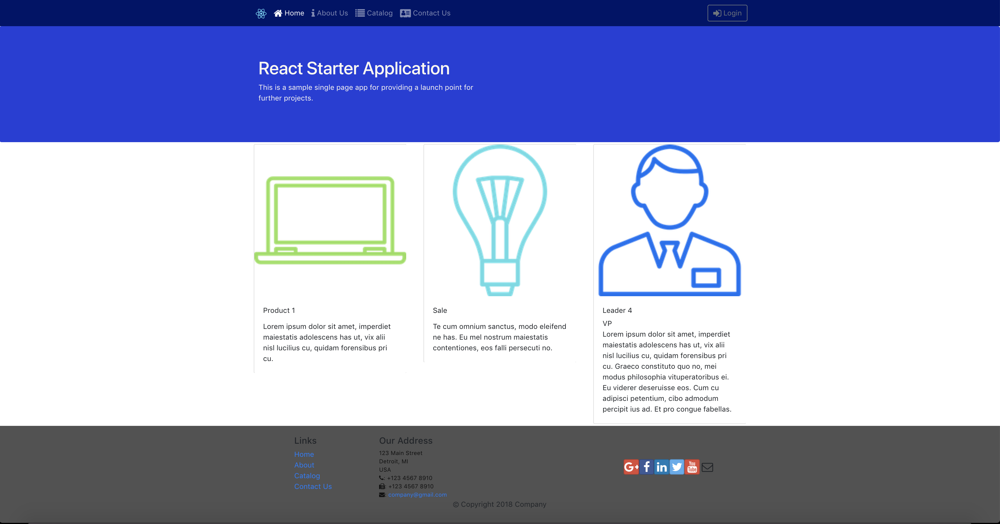
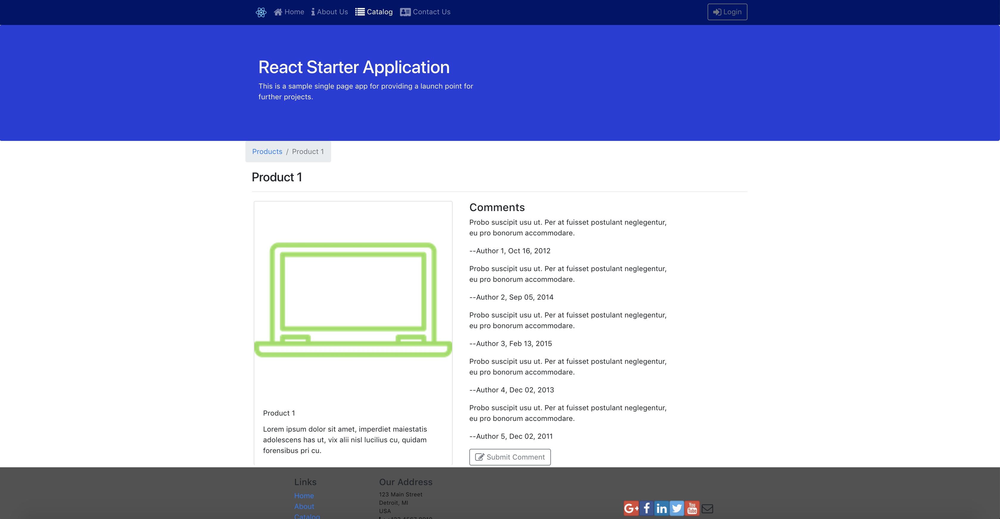
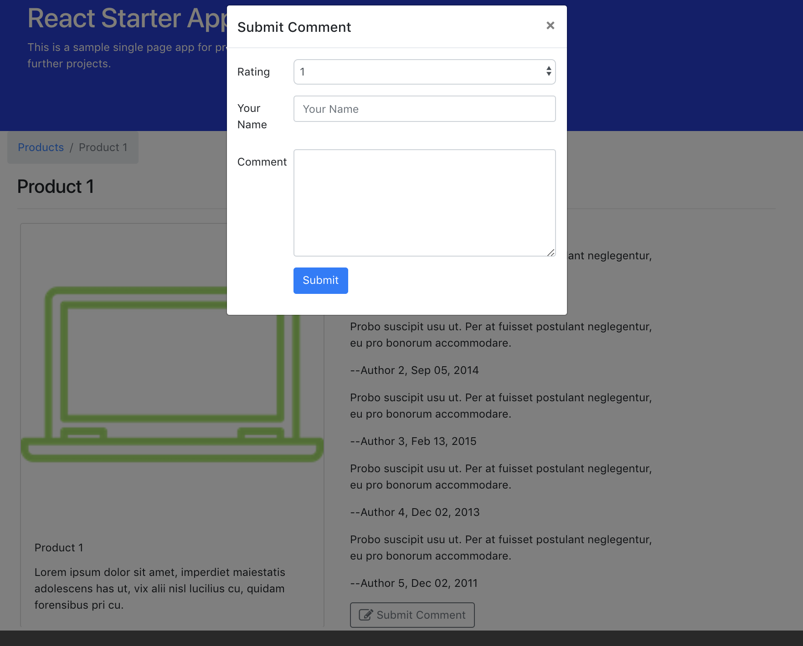
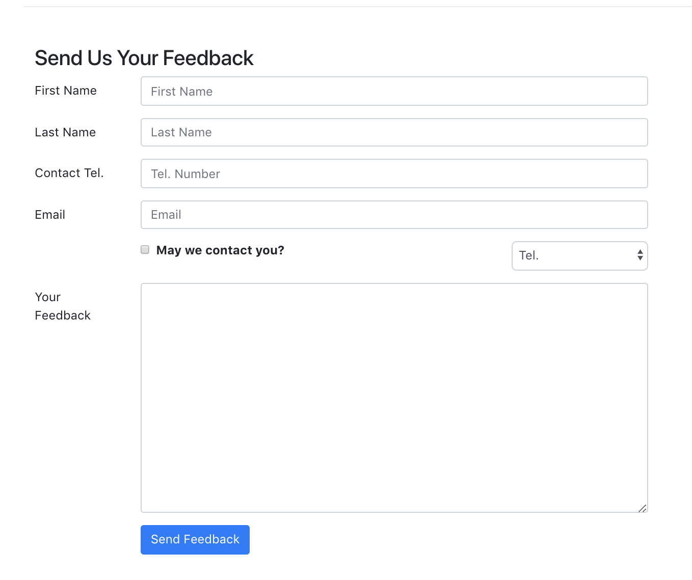

## React Single Page App Starter
Starter app using:
* React
* React Router
* Redux
* Bootstrap
* Thunk
* Logger
* Animations
* Form Validation
* Server communication
* Webpack

&nbsp;
### Build and Run
Included is a json-server for testing server communication with the React application. The application is configured to retrieve images, products, promotions, and leaders of a sample company from the json-server. New comments and feedback can be written to the server database.

&nbsp;

Setup:
```javascript
/* navigate to the json-server from the root directory */
cd starter-json-server

/* Run the following to start a json-server watching the db.json file on port 3001 with a 2000ms delay for testing. */
json-server --watch db.json -p 3001 -d 2000

/* start the React application from the root directory and navigate to port 3000 to view*/
npm start
```

&nbsp;

The json-server can also be used to host the React application.
```javascript
/* build the project from the root directory */
cd react-spa-starter
npm run build

/* move the contents of the webpack-generated build folder to the json-server public directory */
mv build json-server/public

/* restart the server and navigate to port 3001 to view the app */
json-server --watch db.json -p 3001 -d 2000
```
&nbsp;
### Screenshots

&nbsp;


&nbsp;


&nbsp;

